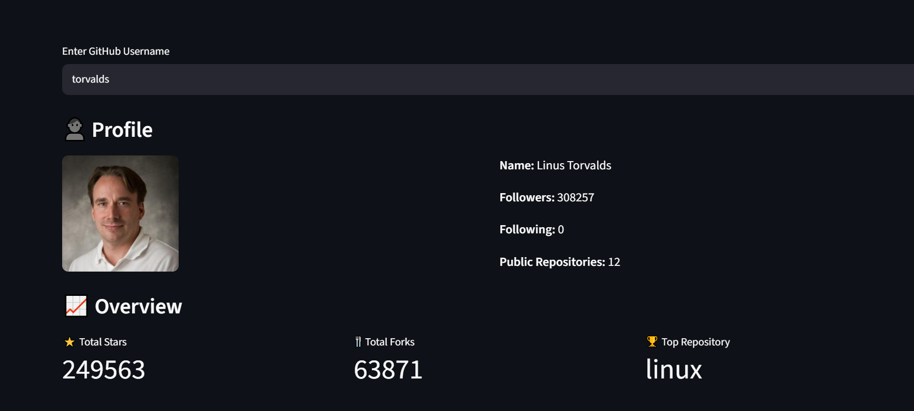
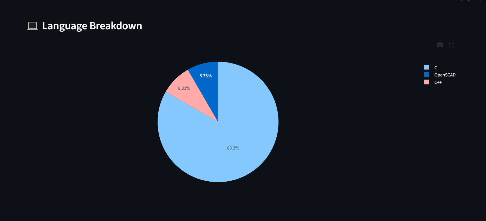
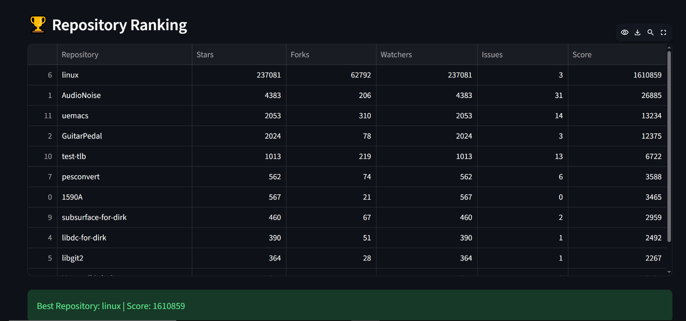

# 📊 GitHub Developer Analytics Dashboard

A Streamlit-based analytics dashboard that provides insights into GitHub developer profiles using the GitHub REST API.

---

## 🚀 Features

- GitHub Profile Analytics
- Total Stars & Forks Tracking
- Top Repository Detection
- Language Breakdown Visualization
- Repository Growth Trends
- Repository Ranking System
- Developer Score Calculation
- Interactive Plotly Charts
- Real-Time GitHub API Data

---

## 🛠️ Tech Stack

- Python
- Streamlit
- Pandas
- Plotly
- Requests
- GitHub REST API

---

## 📸 Screenshots

### 👤 Profile Analytics



### 💻 Language Breakdown



### 🏆 Repository Ranking



---

## 📈 Dashboard Analytics

### Profile Information

- Name
- Followers
- Following
- Public Repositories

### Repository Insights

- Total Stars
- Total Forks
- Top Repository

### Visual Analytics

- Language Distribution
- Repository Creation Trend
- Top Starred Repositories

### Advanced Analytics

- Repository Ranking
- Best Repository Detection
- Developer Score Calculation

---

## 📦 Installation

Clone the repository:

```bash
git clone https://github.com/zaid1-ui/github-analytics-dashboard.git
```

Move into the project:

```bash
cd github-analytics-dashboard
```

Install dependencies:

```bash
pip install -r requirements.txt
```

Run the application:

```bash
streamlit run app.py
```

---

## 📊 Repository Scoring Formula

Each repository is ranked using:

```text
Score =
(Stars × 5)
+ (Forks × 3)
+ Watchers
− Open Issues
```

This score is used to identify the best-performing repositories and calculate the overall developer score.

---

## 🔮 Future Improvements

- Contributor Analytics
- GitHub Authentication
- Activity Heatmaps
- AI-Powered Repository Insights
- Commit Activity Tracking

---
